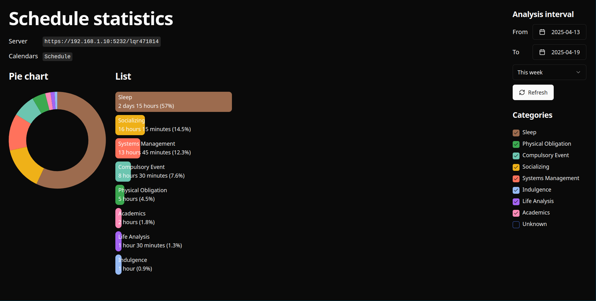

# calutils

> Visualize how your time is spent.



## Configuration

```json5
// config.json5
[
	{
		server: {
			url: "https://<caldav_server_host>/<username>",
			insecure: true, // enable if you want to ignore SSL issues
			username: "<username>",
			password: "<password>",
		},
		calendars: ["<calendar_name>", ...]
	},
	...
]
```

## Usage

```sh
./calutils --config <path/to/config.json5> serve
```

## Build

```sh
cd ui && pnpm build
go build
```